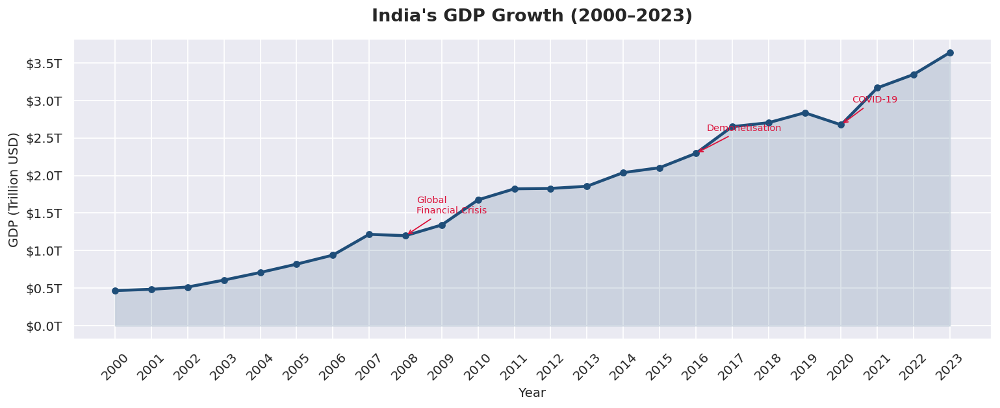
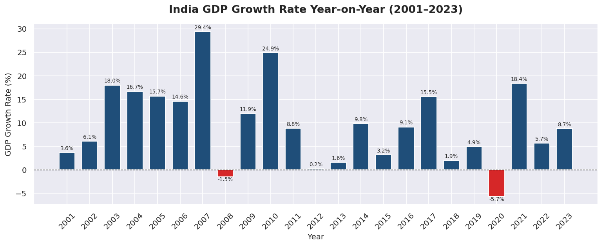
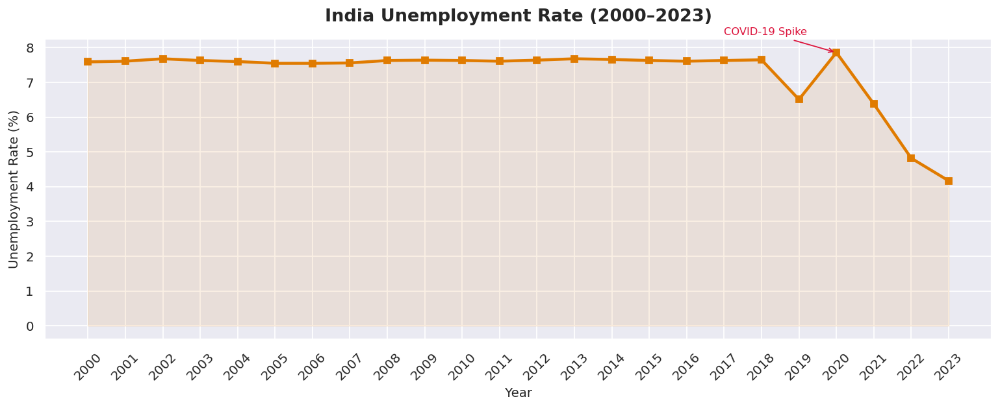
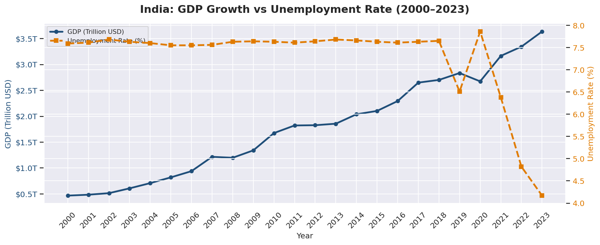
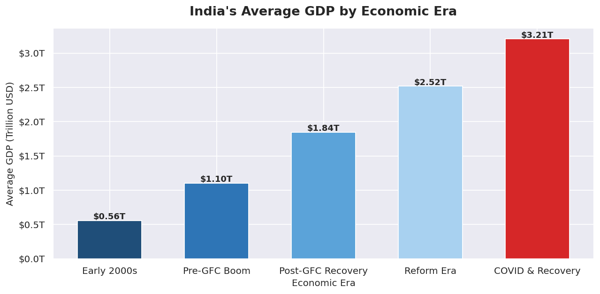

# 🇮🇳 India Economic Analysis (2000–2023)

An exploratory data analysis of India's economic trajectory over 24 years using World Bank open data — covering GDP growth, unemployment trends, and economic era comparisons across key historical events.

---

## 📌 Problem Statement

India has undergone dramatic economic transformation since 2000 — surviving the Global Financial Crisis, demonetisation, and a global pandemic while consistently growing into one of the world's largest economies. This project answers:

- How has India's GDP grown from 2000 to 2023?
- Which years saw the sharpest growth and the steepest contractions?
- How did major events (GFC 2008, Demonetisation 2016, COVID-19 2020) impact the economy?
- What is the relationship between GDP growth and unemployment over time?
- How does India's average GDP compare across distinct economic eras?

---

## 📊 Key Findings

| Metric | Value |
|---|---|
| GDP in 2000 | $0.47 Trillion |
| GDP in 2023 | $3.55 Trillion |
| Total Growth | ~7x in 23 years |
| Peak Growth Year | 2007 at +29.4% |
| Worst Year | 2020 at -5.7% (COVID-19) |
| Average Unemployment (2000–2023) | ~7.4% |
| Lowest Unemployment | 4.2% in 2023 |

---

## 📈 Visualisations

### 1. India's GDP Growth (2000–2023)
Steady upward trajectory with visible dips at the Global Financial Crisis (2008), Demonetisation (2016), and COVID-19 (2020). India recovered strongly after each shock.



---

### 2. GDP Growth Rate Year-on-Year (2001–2023)
Only two years of negative growth in 24 years — 2008 (-1.5%) and 2020 (-5.7%) — highlighting India's economic resilience. The 2021 rebound of +18.4% was the strongest recovery year.



---

### 3. Unemployment Rate (2000–2023)
Unemployment remained remarkably stable at ~7.6% for nearly two decades before spiking to 7.9% in 2020 during COVID-19 lockdowns. Post-2020 saw a sharp structural decline, dropping to 4.2% by 2023 — suggesting a significant shift in employment patterns.



---

### 4. GDP Growth vs Unemployment (Dual Axis)
While GDP grew 7x over 23 years, unemployment remained largely flat until 2019 — indicating that India's economic growth was concentrated in capital-intensive sectors rather than broad-based job creation. The post-2020 divergence is particularly striking.



---

### 5. Average GDP by Economic Era
India's average GDP nearly doubled with each successive economic era — from $0.56T in the Early 2000s to $3.21T during the COVID & Recovery period, demonstrating consistent long-run structural growth despite short-term shocks.



---

## 🗂️ Project Structure

```
India-Economic-Analysis/
│
├── india_economy_cleaning.py       # Data cleaning & feature engineering
├── india_economy_analysis.py       # Visualisation script
├── india_economy_analysis.ipynb    # Jupyter Notebook version
│
├── data/
│   ├── raw/                        # Raw World Bank CSVs (not included)
│   └── india_economy_clean.csv     # Cleaned & merged dataset
│
├── charts/
│   ├── 01_gdp_growth.png
│   ├── 02_gdp_growth_rate.png
│   ├── 03_unemployment.png
│   ├── 04_gdp_vs_unemployment.png
│   └── 05_gdp_by_era.png
│
└── README.md
```

---

## 🛠️ Tools & Libraries

| Tool | Usage |
|---|---|
| **Python 3.10+** | Data cleaning and visualisation |
| **Pandas** | Data loading, merging, feature engineering |
| **Matplotlib** | All chart creation and customisation |
| **Seaborn** | Chart theming and styling |
| **Jupyter Notebook** | Interactive analysis environment |
| **World Bank Open Data** | Source datasets |

---

## 🚀 How to Reproduce

### Step 1 — Download the Datasets
Go to [data.worldbank.org](https://data.worldbank.org) and download CSV exports for:
- GDP (NY.GDP.MKTP.CD) — India
- Unemployment Rate (SL.UEM.TOTL.ZS) — India
- Economic Policy Score (IQ.CPA.PROT.XQ) — India

Place all CSVs in `data/raw/`

### Step 2 — Run the Cleaning Script
```bash
pip install pandas
python india_economy_cleaning.py
```

### Step 3 — Run the Analysis
```bash
pip install matplotlib seaborn jupyter
python india_economy_analysis.py
```
Or open `india_economy_analysis.ipynb` in Jupyter for an interactive view.

---

## 🧹 Data Cleaning Steps

| Step | Description |
|---|---|
| Skip header rows | World Bank CSVs have 4 junk rows before actual data |
| Filter for India | Filtered all datasets to `Country Code == "IND"` |
| Melt year columns | Converted wide format (year as columns) to long format (year as rows) |
| Merge datasets | Joined GDP, Unemployment on `Year` using outer merge |
| GDP Growth Rate | Calculated year-on-year % change using `pct_change()` |
| Economic Era labels | Binned years into 5 named eras for macro-level comparison |
| GDP formatting | Created readable `GDP_Label` column (e.g. "$3.55T") |

---

## 🔍 Key Concepts Practiced

- Loading and parsing real-world government/financial datasets
- Reshaping wide-format data to long-format using `melt()`
- Multi-dataset merging with `pd.merge()`
- Derived column creation (`pct_change()`, `pd.cut()`, `.apply()`)
- Time-series visualisation with milestone annotations
- Dual-axis charts for multi-indicator comparison
- Insight-driven chart titles and economic storytelling

---

## 📝 Data Sources

- [World Bank — GDP (current US$)](https://data.worldbank.org/indicator/NY.GDP.MKTP.CD)
- [World Bank — Unemployment, total (% of total labor force)](https://data.worldbank.org/indicator/SL.UEM.TOTL.ZS)
- Raw CSVs are **not included** in this repo. Download directly from World Bank as per Step 1.

---

*Built to practice time-series EDA and economic data storytelling using Python 📊*
